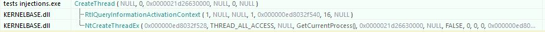
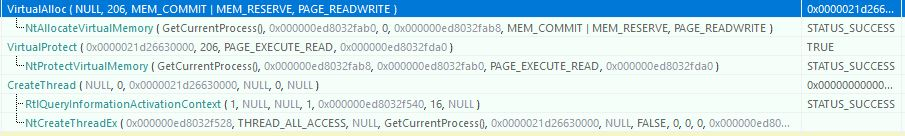

# HookEvasion
Some malware researchers shows the ongoing trend of using direct system calls to evade anti-virus and edrs user-land hooks.

Microsoft's Win32 API has 2 "layers":
- The exposed user-land layer that is documented on MSDN, The role of this layer is to make all the necessary adjustments and verifications to params.
- the undocumented layer that resides in the user-land, and execute syscalls in order to execute the functions in the kernel.

By checking if any function that the exposed layer calls is hooked, we can decide which function to call in run time, to evade the hook itself.

Unlike linux, Windows syscalls change often and without any announcement as Microsoft never intended it to be used directly.
The POC has been tested on Windows 10 21H2, and might not work on other versions, as the syscall number has been changed.
If you would like to try the POC yourself, i would suggest looking at the [mapping](https://j00ru.vexillium.org/syscalls/nt/64/) (made by Mateusz "j00ru" Jurczyk) to find the syscall ID that matches your OS version.

By using API Monitor, we could see how the calls look like, when using WinAPI:

When using API Monitor to run the POC, well.. you would be able to see anything :wink:

## Why wouldn't i just hook the kernel?
The PatchGuard (or Kernel Patch Protection - KPP) is a security mechanism that scans the memory all the time, and prevent changes to the SSDT (System Service Descriptor Table).

It is possible to turn the PatchGuard off by patching ntoskrnl.exe, but there are some sotwares like video game anti cheats that scans for that and count that as indicator for hacking (as they themself, cannot detect hacks that run in the kernel), so a lot of companies would not patch the KPP to avoid such scenarios.

## How do i know its really working? 	:raised_eyebrow:
The repo contains a dll called `virtualAllocHook.dll` that will call `MessageBox` once `VirtualAlloc` is called.
just add `HMODULE SampleHookDllModule = LoadLibrary(TEXT("virtualAllocHook.dll"));` at the top of your code to load it, and change the if statements a bit to make it run `VirtualAlloc`.

By doing so, you could see the message box + the API call itself in API Monitor.

## What this POC DOESN'T cover
- Static Analysys - Security products could still flag this code as malicious by static analysis.
- Hides network activity - Even if you use syscalls to make network actions, it could still be monitored (both on the network card level, and network firewall).
- Patch the hook - You could patch the hook by loading a copy of the desired DLL from disk, and using its own un-modified functions, or just overrite the hook itself, but some security products check if the hook has been patched, so i just avoid it.

## Disclamer 
This project is purely for learning purposes, and is not meant to be used in any illegal or unethical way.

I will not be liable for any loss or damage from any cause to your system or site, or to people linking to this material from your web site, caused by or in connection with the use or link to this material. Any such loss or damage will be your responsibility. I advise you to take your own precautions in relation to protecting your system or web site from malfunction or viruses.
